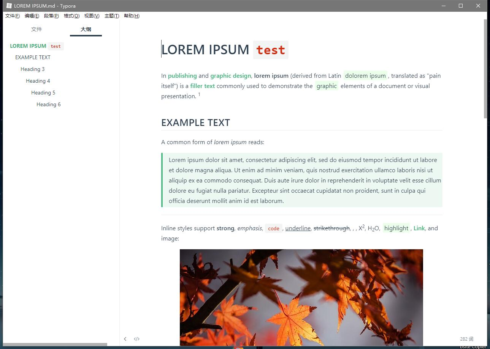
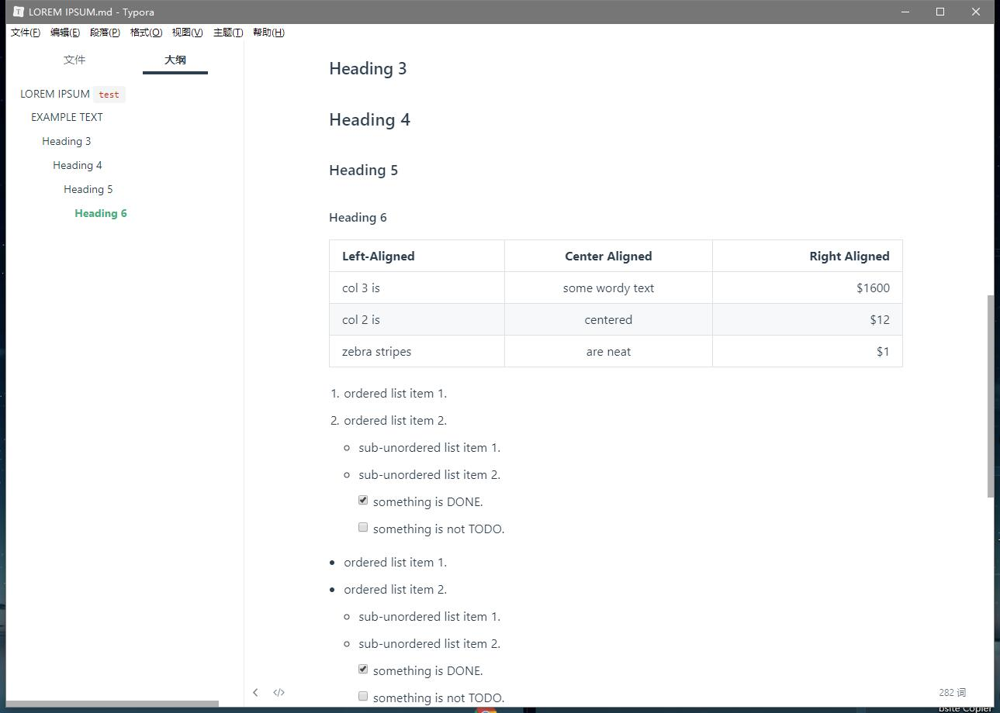
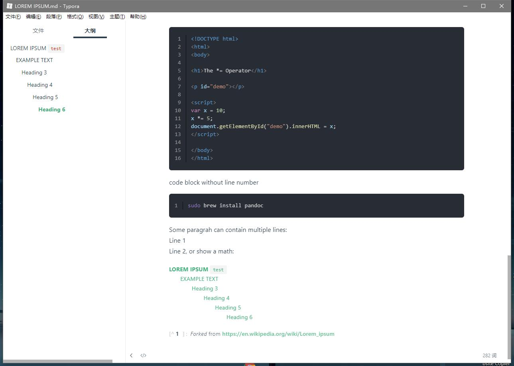

# typora-theme-vuepress

一个 VuePress 风格的 Typora Markdown 编辑器主题。

## 简介

参考了 [Vue](https://vuejs.org/)、[VuePress](https://vuepress.vuejs.org/) 风格而开发的一个 Typora 自定义主题。

## 安装主题

1. 下载本主题中的`vuepress.css`文件；
2. 打开 Typora，点击“**偏好设置**” => “**打开主题文件夹**”按钮，将弹出 Typora 的主题文件夹；
3. 将下载好的`vuepress.css`放到 Typora 的主题文件夹中；
4. 关闭并重新打开 Typora，从菜单栏中选择 “**主题**” => “**Vuepress**” 即可。

## 效果图

> **感谢**: [typora-vue-theme](https://github.com/blinkfox/typora-vue-theme)
